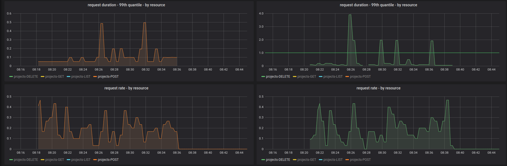
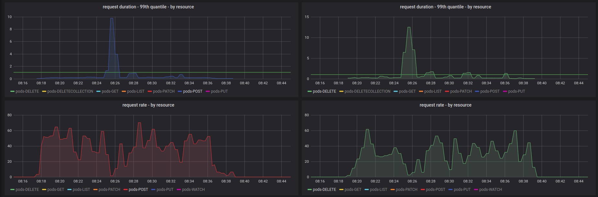
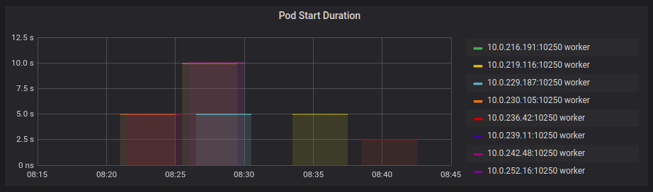
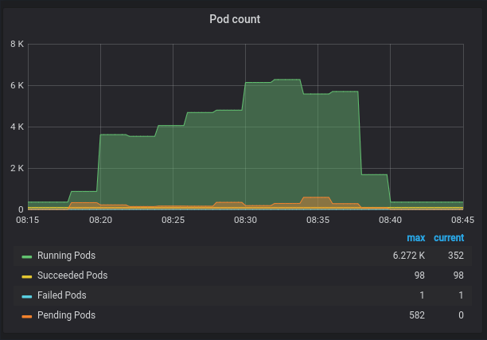
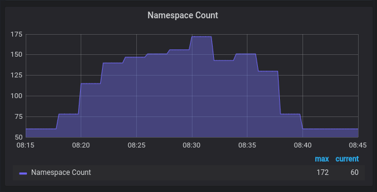
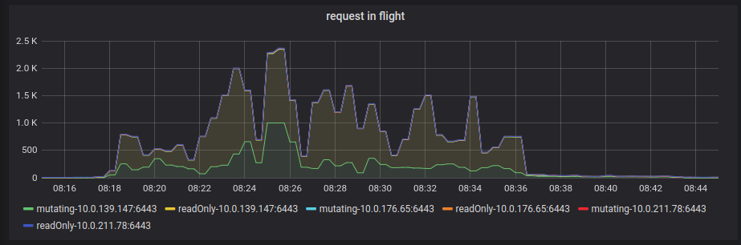
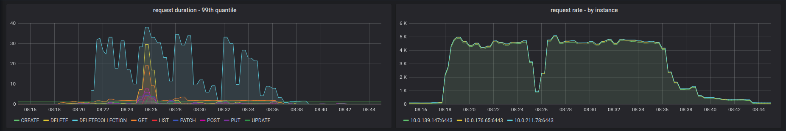
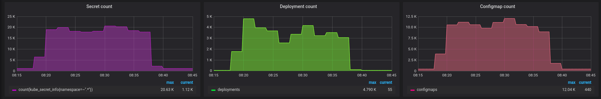

## Cluster Configuration:
* Platform: AWS
* OCP Version :  4.5.0-rc1
* Kubernetes Version: 1.18.3
* Worker Node count: 25/100/250
* Master node count: 3
* Infrastructure node count: 3
* Masters node instance type: r5.4xlarge
* Infrastructure Node instance type : m5.12xlarge
* Worker Node instance type:  m5.2xlarge

Max Pod per worker node: 500

## Goal
Simulate customer workload to get better insights into what sort of bottlenecks the customer might run into in a production 
OpenShift environment.

**Customer Workload**:
* 1000 namespaces created/deleted every day (a large portion of the API load)
* 30,000 pod create/deletes per day (this is the majority of the API load)
* 1500 namespaces at any given time
* 3500 running pods at any given time

We have the following goals:
* Generate load to simulate the customer workload with `Priority & Fairness` disabled. We will use this as the baseline.
* Enable `Priority & Fairness`, run the test under an `exempt` user. We expect to see similar results as the baseline.
* Run the test under an `non-exempt` user. We expect to see similar results as the baseline.

## Test Strategy:
* `Project` churning: To ensure that we have namespace churning, `Project` will be created on the fly. Each `Project` will host a certain
  number of `Deployment` objects in its lifetime after which it will be deleted.
* `Pod` churning: The test worker(s) creates `Deployment` object(s), waits for the associated `Pod` to be in `Running` phase and allows 
  it to run for a certain amount of time before the `Deployment` is deleted.
* While the customer workload `Pod` does application specific stuff, our test will use a pause (`k8s.gcr.io/pause:3.1`) Pod.

## Result - Baseline
**Project Churning:**

* An average of `0.2` `Project` create/second (lower left)
* An average of `0.2` `Project` delete/second (lower right)

Overall, we see about 700 Project being churned per hour.  

**Pod Churning:**

* An average of `25` `Pod` create/second (lower left)
* An average of `25` `Pod` delete/second (lower right)

Overall, we see about 90K Pod being churned per hour.

*Pod Start Duration:*

Maximum number of running Pods at any time is `6.2K`.

Maximum number of Nmespaces at any given time is `175` 

**Load on the API Server:**

`max-mutating-requests-inflight` peaked at `1K`, so we saw some mutating requests getting `429` since `1K` is the 
limit for mutating requests.

Cluster Latency and Throughput: 

**Object Count**

