## Goal
Our goal is to design an artificial workload that can saturate a master node of a dev cluster and use that to 
measure performance characteristics of the Priotity&Fairness feature.   

The dev cluster we use has the following configuration:
* The cluster has been setup in `aws`.
* 3 master nodes and 3 worker nodes.
* Each node is a `m4.2xlarge` type. It has 8 cpu cores, 32GiB of RAM, and it is EBS optimized (1000 Mbps).

When we offer the workload to the cluster, cpu usage of the master node receiving the traffic gets as close as `100%`.

Here are the steps we will follow:
* Initially we disable the Priority & Fairness feature, execute the load test and measure API performance to establish a baseline. 
* Enable the Priority & Fairness feature and execute the same load test.
* Compare the results against the baseline.

In both scenarios, each test must be run multiple times to ensure that the results we obtain are consistent and reproducible.

The Load test has the following criteria:
* `1000` namespaces are created upfront before the test is kicked off.

The test comprises of multiple steps. Each step can have a number of phases. Steps are run one at a time in the given 
order. Phases within a step are run in parallel. 

**Step 1**: Create Objects - this step creates the objects in the test namespaces set up above. It has a few phases which 
are executed in parallel.
* *Phase 1*: A total of `700` `Deployment` objects are created, each in a separate namespace.
  * The `Deployment` objects are created one at a time.
  * Each `Deployment` has exactly one `Pod`.
  * Each `Deployment` object has a corresponding `ConfigMap` and a `Secret` object that are mounted to its pod. 
  * Each `Deployment` is backed by a `Service` object.
* *Phase 2*: A `ServiceAccount` object is created in each namespace one at a time.
* *Phase 3*: `50` go-routines concurrently execute to accomplish the following:
  * `100` `Secret` objects in each namespace
  * `100` `ConfigMap` objects in each namespace

**Step 2**: Wait for the pods to be running.

**Step 3**: Delete the `Deployment` objects (including the mounted `ConfgiMap` and `Secret` objects). Two go-routines 
concurrently take turn.

**Step 4**: Wait for the `Pods` to be removed. Two go-routines concurrently take turn.

**Step 5**: Delete the `Service` objects associated with the `Deployment` objects. Two go-routines concurrently take turn. 

**Step 6**: Delete the `ConfigMap` and `Secret` objects (each `100K`). Two go-routines concurrently take turn.

## Comparison:
The table below puts some measurements side by side for comparison.  

Measurement | Baseline | Priority&Fairness Enabled
--- | --- | ---
*Load Average* |   | 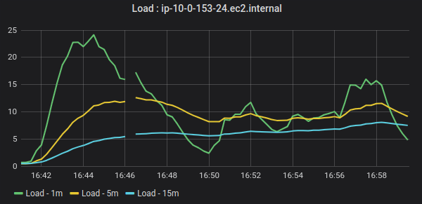
*CPU Usage* |   | 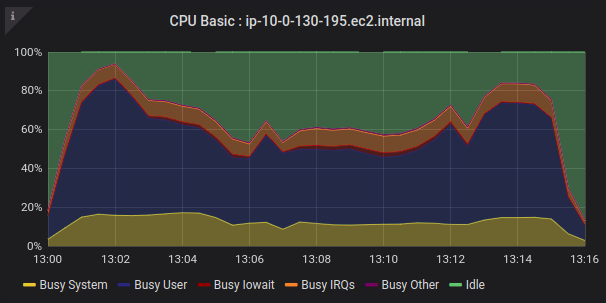
*System Memory* | 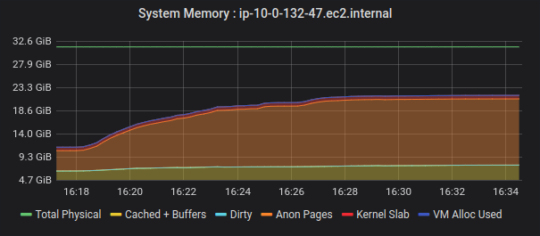  | 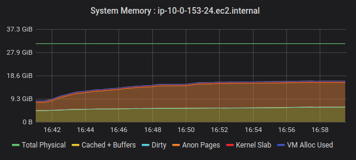
*Request Duration* | 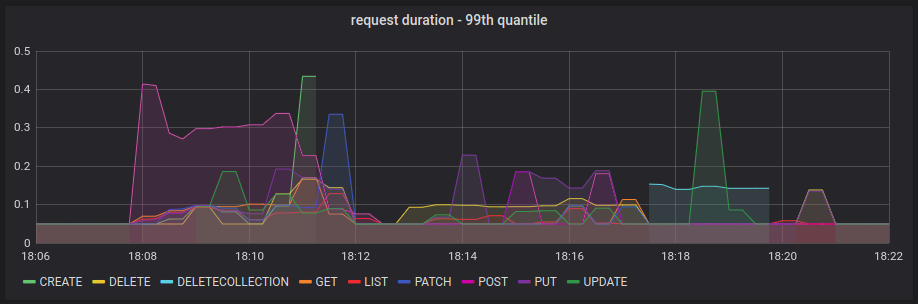  | 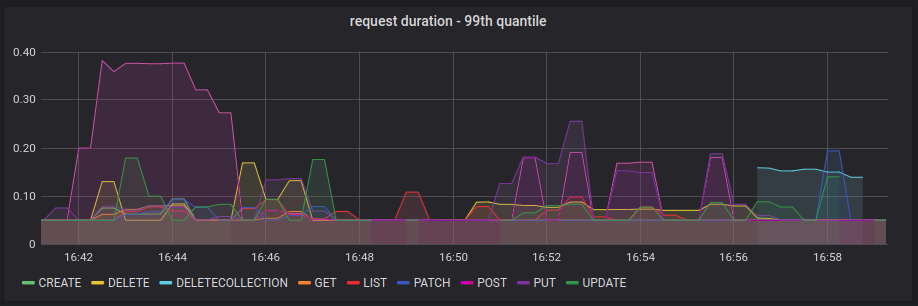
*Request Rate* | 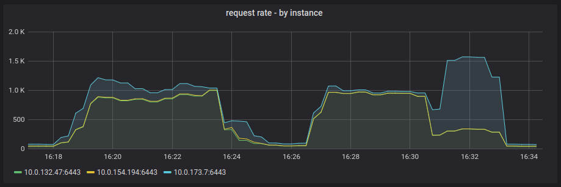  | 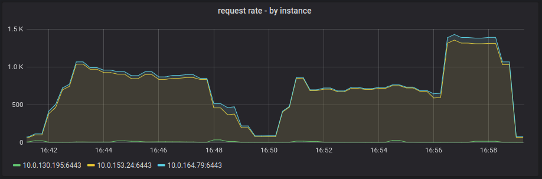
*Request In-Flight* | 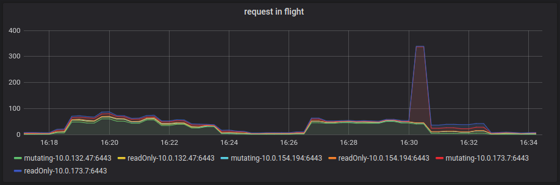  | 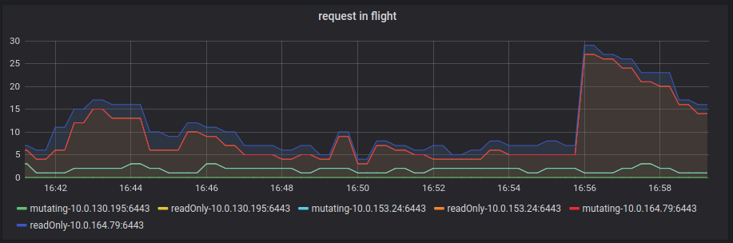
*Request Rejected* | 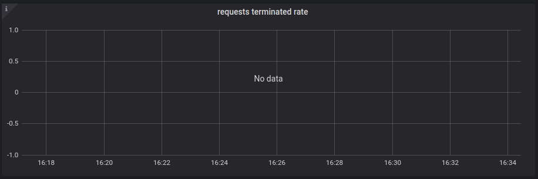  | 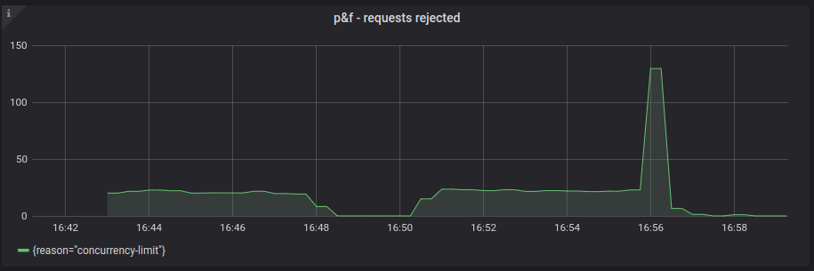

In both cases, the test run is successful:
* 700/700 Deployments are running with all pods.
* all objects are created and deleted afterwards successfully.

**Summary**:
* The results are fairly comparable with one major difference.
* With `Priority&Fairnes` enabled we see quite a few requests are rejected with `Retry-After 1s` error. The 
  `Retry` error is thrown from the `Priority&Fairnes` handler with a reason of `concurrency-limit`.
  
**Next Steps**:
* Find out whether the `Retry-After 1s` errors thrown by `Priority&Fairnes` are expected. If not can we tune it to 
  eliminate these errors?
* Even though the CPU usage on the master node gets close to `100%`, the maximum number of requests in flight were 
  near `80`. Maybe we can add a handler that introduces artificial delay to the requests generated by the load tester? 
  This way we can get a significantly higher value of `max-in-flight` that will put the `Priority&Fairnes` feature to test.
* In contrast, try setting a much lower limit of `max-in-flight`. We should have an unstable baseline where we should see
  request from kubelet or kube-controller-manager fail indiscriminately. With Priority&Fairness enabled we expect to see a 
  more stable cluster where requests from kubelet/kube-controller-manager are prioritized. 
* Coordinate with the perf-team to kick off big cluster scale test.
