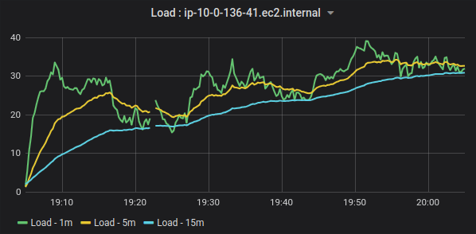
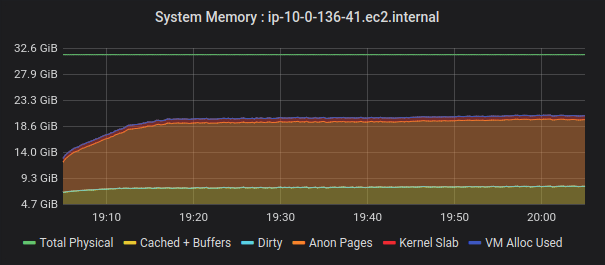
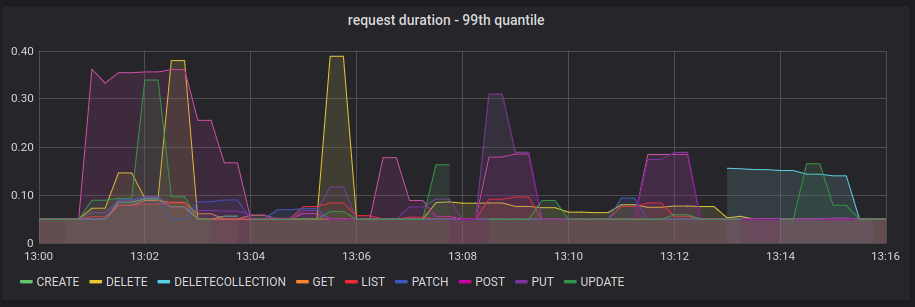
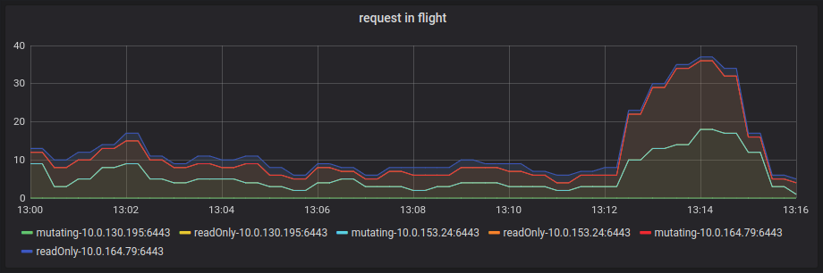
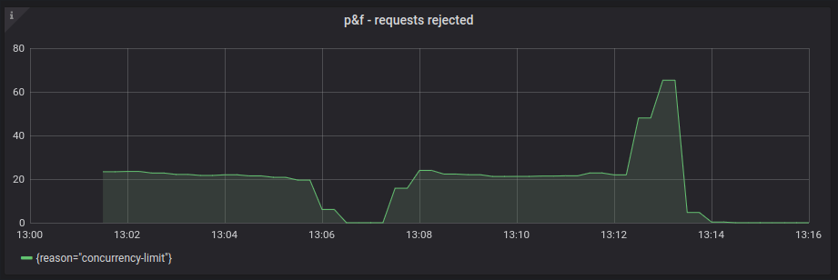

## Goal
The goal of this test is to design an artificial workload that can cause control plane traffic disruption: 
* Artificially set lower limit for max-in-flight to force the apiserver to drop requests. 
* Show that control plane traffic (kubelet, kube-controller-manager and scheduler) gets dropped by the apiserver indiscriminately.
* 
With Priotity&Fairness enabled we expect to see no disruption.   

The dev cluster we use has the following configuration:
* The cluster has been setup in `aws`.
* 3 master nodes and 15 worker nodes.
* Each node is a `m4.2xlarge` type. It has 8 cpu cores, 32GiB of RAM, and it is EBS optimized (1000 Mbps).

When we offer the workload to the cluster, cpu usage of the master node receiving the traffic gets as close as `100%`.

Here are the steps we will follow:
* Initially we disable the Priority & Fairness feature, execute the load test and measure API performance to establish a baseline. 
* Enable the Priority & Fairness feature and execute the same load test.
* Compare the results against the baseline.

In both scenarios, each test must be run multiple times to ensure that the results we obtain are consistent and reproducible.

The Load test has the following criteria:
* `500` namespaces are created upfront before the test is kicked off.

The test comprises of multiple steps. Each step can have a number of phases. Steps are run one at a time in the given 
order. Phases within a step are run in parallel. 

**Step 1**: Create Objects - this step creates the objects in the test namespaces set up above. It has a few phases which 
are executed in parallel.
* *Phase 1*: A total of `7500` `Deployment` objects are created, equally distributed into `500` namespaces.
  * The `Deployment` objects are created `50` at a time.
  * Each `Deployment` has exactly one `Pod`.
  * Each `Deployment` object has a corresponding `ConfigMap` and a `Secret` object that are mounted to its pod. 
  * Each `Deployment` is backed by a `Service` object.
* *Phase 2*: `100` go-routines concurrently execute to accomplish the following:
  * Create, read and  delete a `Secret`, `ConfigMap`, and `ServiceAccount` 

**Step 2**: Wait for the pods to be running.

**Step 3**: Delete the `Deployment` objects (including the mounted `ConfgiMap`, `Secret` and `Service` objects). Two go-routines 
concurrently take turn.

**Step 4**: Wait for the `Pods` to be removed.

## Comparison:
The table below puts some measurements side by side for comparison. 
* Each graph here scales to an exact `16` minute window on the X axis.
* The CPU Usage, Load average and System Memory metrics are of the master node that received the traffic from the load generator.

Control Plane Traffic:
Baseline:

Measurement | Baseline | Priority&Fairness Enabled
--- | --- | ---
*Test Duration* | Approximately 13 minutes | Approximately 15 minutes
*Load Average* |   | 
*CPU Usage* |   | 
*System Memory* |   | 
*Request Duration* |   |  
*Request Rate* |   | 
*Request In-Flight* |   | 
*Request Rejected* |   | 

In both cases, the test run is successful:
* 700/700 Deployments are running with all pods.
* all objects are created and deleted afterwards successfully.

**Summary**:
* With `Priority&Fairnes` enabled we see quite a few requests are rejected with `Retry-After 1s` error. The 
  `Retry` error is thrown from the `Priority&Fairnes` handler with a reason of `concurrency-limit`.
* The CPU usage with `Priority&Fairnes` enabled is a little lower.
* Number of requests in-flight with `Priority&Fairnes` enabled is lower than that of the baseline.
* The test with `Priority&Fairnes` enabled runs about two minutes longer than the baseline test.
* response time (99th quantile) is slightly better with `Priority&Fairnes` enabled. 

From the above we can infer that `Priority&Fairnes` is throttling on the load by rejecting requests from the load 
generator with `Retry` error. This explains why the test runs a little longer with `Priority&Fairnes`.
  
  
**Next Steps**:
* Find a way to remove `kube-apiserver` instances from both the external and the internal load balancers. 
  This way we can ensure that all of control plane traffic and traffic from the load generator end up in a single 
  apiserver instance. This will ensure a more consistent test run.
* Measure pod scheduling time and how long it takes a pod to be in `Running` state.    
* Find out whether the `Retry-After 1s` errors thrown by `Priority&Fairnes` are expected. If not can we tune it to 
  eliminate these errors?
* Even though the CPU usage on the master node gets close to `100%`, the maximum number of requests in flight were 
  near `80`. Maybe we can add a handler that introduces artificial delay to the requests generated by the load tester? 
  This way we can get a significantly higher value of `max-in-flight` that will put the `Priority&Fairnes` feature to test.
* In contrast, try setting a much lower limit of `max-in-flight`. We should have an unstable baseline where we should see
  request from kubelet or kube-controller-manager fail indiscriminately. With Priority&Fairness enabled we expect to see a 
  more stable cluster where requests from kubelet/kube-controller-manager are prioritized. 
* Coordinate with the perf-team to kick off big cluster scale test.
