## Goal
The goal of this test is to: 
* Disable `Priority&Fairness` and set a lower limit for `max-requests-inflight` to force the `kube-apiserver` to 
  indiscriminately drop requests with a `Retry-After` error (HTTP status code `429`). 
* Establish that important traffic like requests from control plane components like kubelet, kube-controller-manager and
  scheduler get dropped indiscriminately.
  
Once we have established the above we do the following:
* Enable `Priority&Fairness` and reset the `max-requests-inflight` changes. Run the same load test.
* We expect the `kube-apiserver` to drop requests.
* We expect the `kube-apiserver` to not drop any requests originating from the control plane components.  

## Test Setup
The dev cluster we use has the following configuration:
* The cluster has been setup in `aws`.
* 3 master nodes and 15 worker nodes.
* Each node is a `m4.2xlarge` type. It has 8 cpu cores, 32GiB of RAM, and it is EBS optimized (1000 Mbps).

When we offer the workload to the cluster, cpu usage of the master node receiving the traffic gets as close as `100%`.

For the Baseline, the `max-requests-inflight` settings are as below:
```
$ kubectl -n openshift-kube-apiserver get cm config -o json | jq -r '.data."config.yaml"' | jq '.apiServerArguments'
{
  "feature-gates": [
    "APIPriorityAndFairness=false"
  ],
  "max-mutating-requests-inflight": [
    "100"
  ],
  "max-requests-inflight": [
    "40"
  ],
}
```

The Load test has the following criteria:
* `500` namespaces are created upfront before the test is kicked off.

The test comprises of multiple steps. Each step can have a number of phases. Steps are run one at a time in the given 
order. Phases within a step are run in parallel. 

**Step 1**: Create Objects - this step creates the objects in the test namespaces set up above. It has a few phases which 
are executed in parallel.
* *Phase 1*: A total of `7500` `Deployment` objects are created, equally distributed into `500` namespaces.
  * The `Deployment` objects are created `50` at a time.
  * Each `Deployment` has exactly one `Pod`.
  * Each `Deployment` object has a corresponding `ConfigMap` and a `Secret` object that are mounted to its pod. 
  * Each `Deployment` is backed by a `Service` object.
* *Phase 2*: `100` go-routines concurrently execute to accomplish the following:
  * Create, read and  delete a `Secret`, `ConfigMap`, and `ServiceAccount` 

**Step 2**: Wait for the pods to be running.

**Step 3**: Delete the `Deployment` objects (including the mounted `ConfgiMap`, `Secret` and `Service` objects). Two go-routines 
concurrently take turn.

**Step 4**: Wait for the `Pods` to be removed.

## Comparison:
* Each graph here scales to an exact `1h` window.
* The CPU Usage, Load average and System Memory metrics are of the master node that received the traffic from the load generator.

**Control Plane Traffic Analysis**:

*Baseline*:
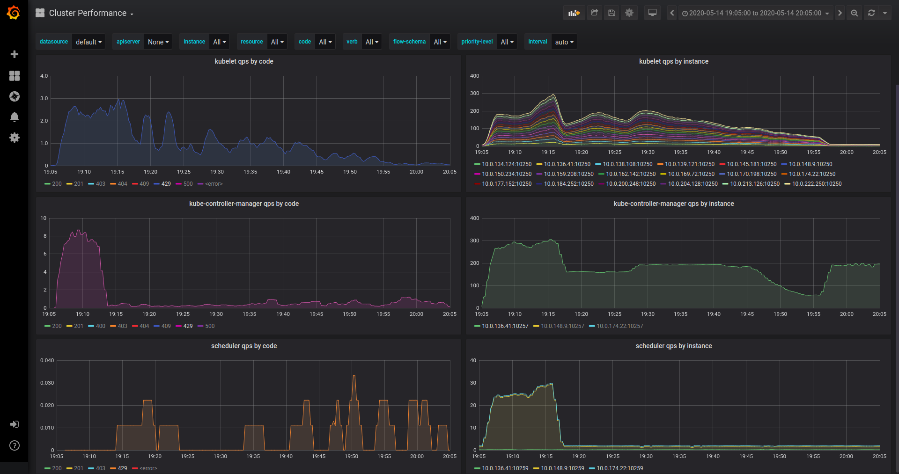

*P&F Enabled*:
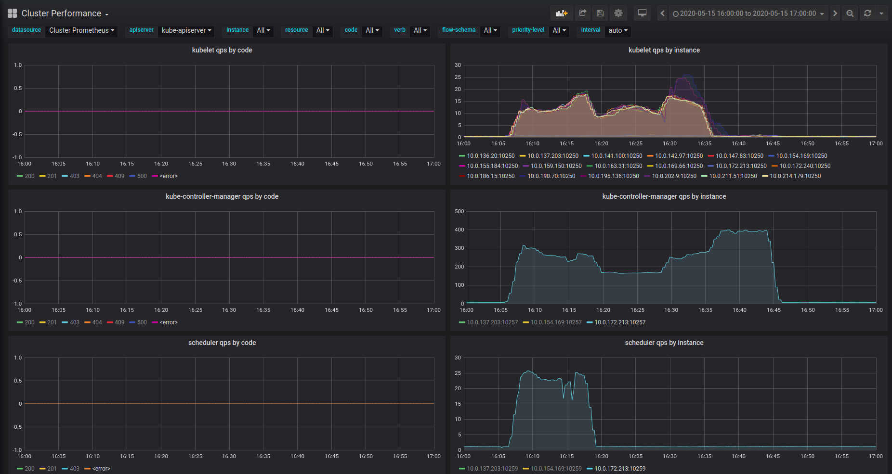

*Analysis*:
* As expected, we can verify that with `Priority&Fairness` disabled, requests from control plane components were rejected
  by the apiserver as expected. The panels on the left column show requests that received `429` or `Retry-After` from the
  server. 
* On the other hand, when we enabled `Priority&Fairness`, the apiserver did not reject any request from the control plane
  components.
* In fact, with `Priority&Fairness` enabled the apiserver rejected more requests than the baseline but it was from the
  lower priority category.
* It might be surprising why the test ran shorter with `Priority&Fairness` enabled. I think it's because some part of 
  the load generator does not retry on a failure, so the total amount of work done by the apiserver was less in this case.   

Measurement | Baseline | Priority&Fairness Enabled
--- | --- | ---
*Load Average* | 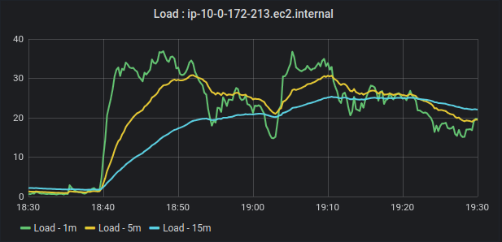  | 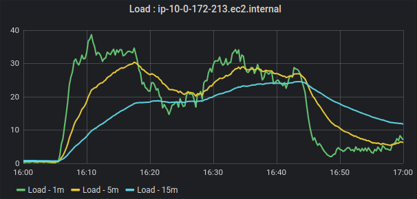
*CPU Usage* | 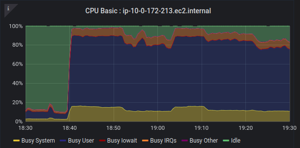  | 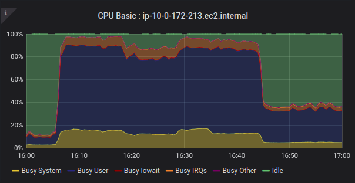
*System Memory* | 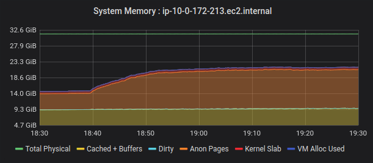  | 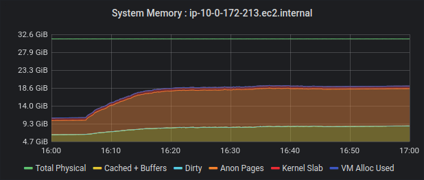
*Request Rate* | 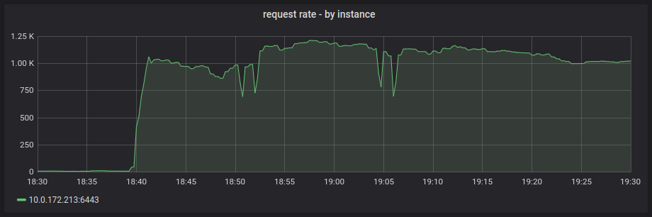  | 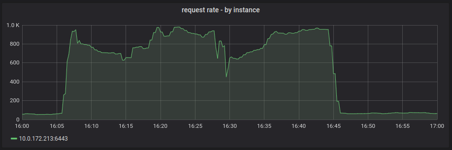
*Request In-Flight* | 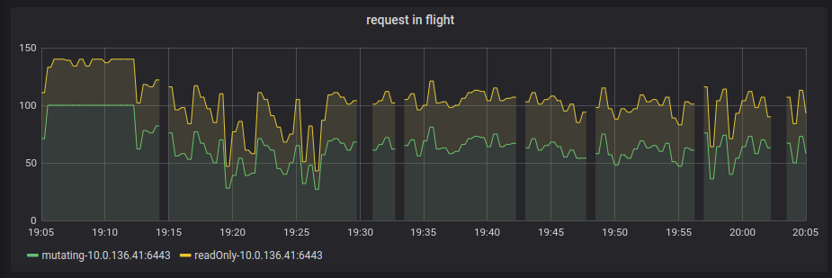  | 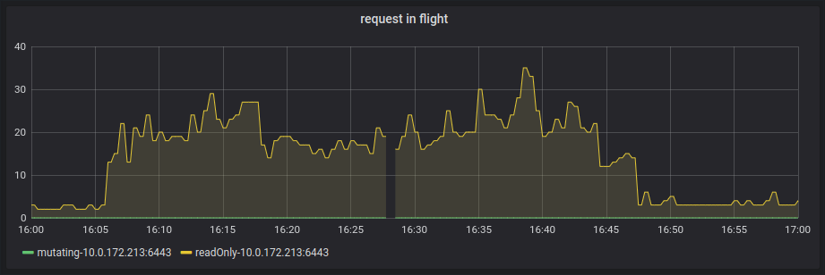
*Request Rejected* | 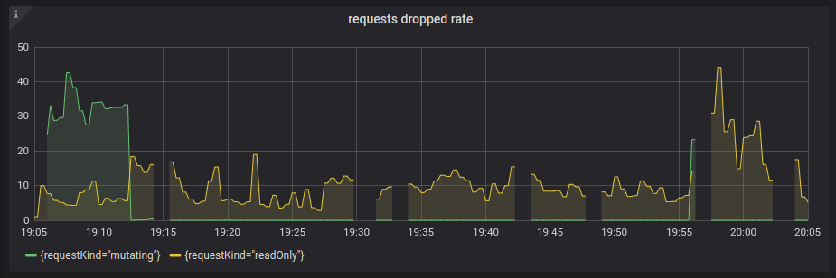  | 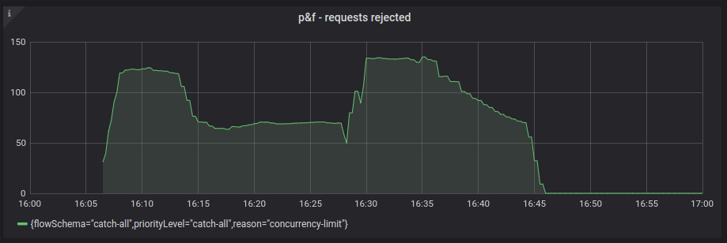

