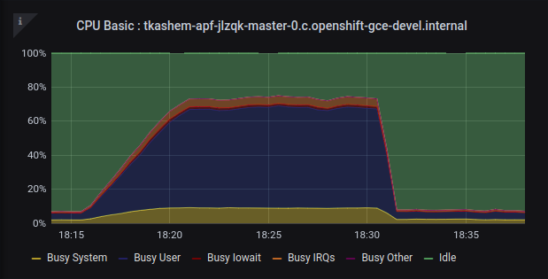
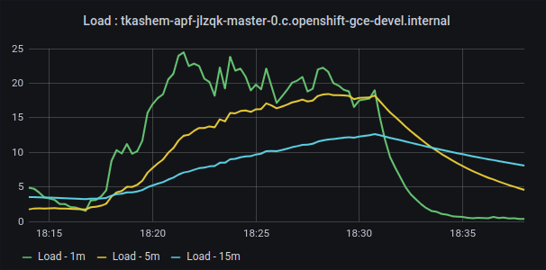
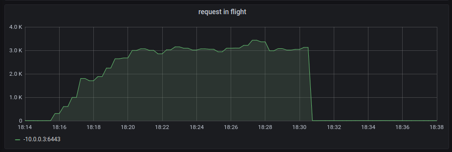
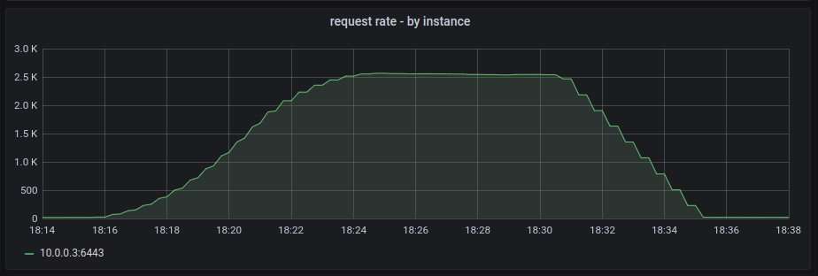
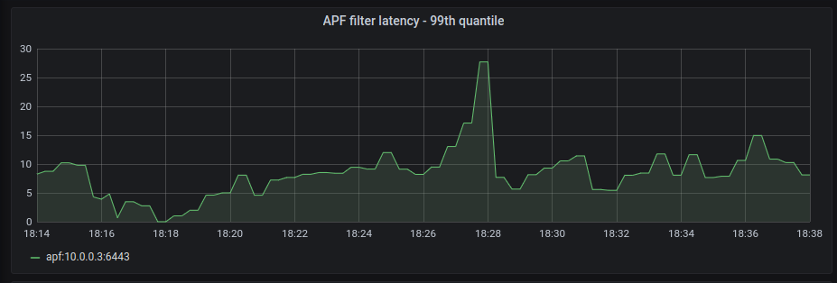
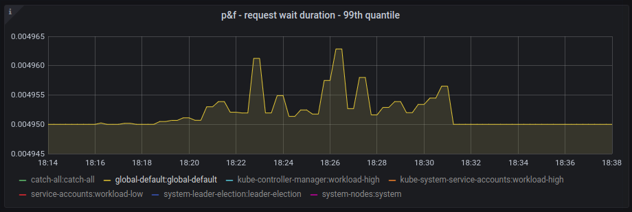
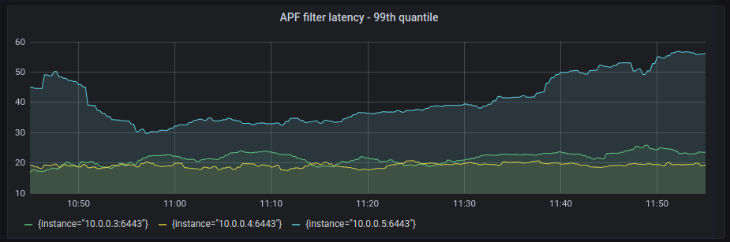
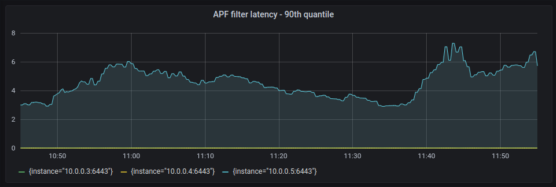
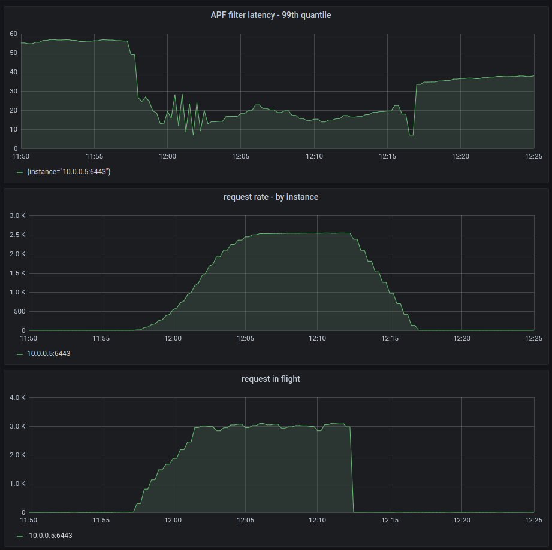
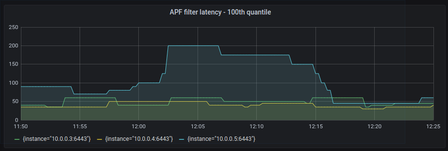

## Objective
Our goal is to measure the latency request(s) incur in priority and fairness machinery.  We define this latency as the
duration elapsed in `B - A`:
- A: priority and fairness filter starts executing for a request.
- B: priority and fairness has applied its logic and has just started executing the next filter in the chain for the 
  given request.   

We will refer to it as APF filter latency throughout this document.

## Test Environment:
```
Server Version: 4.6.0-0.ci-2020-09-24-141743
Kubernetes Version: v1.19.0-rc.2.1055+8f59bb6b1d6a92-dirty
```

Cluster:
- OpenShift 4.6 cluster.
- Hosted on GCP
- 3-node cluster (3 master nodes, 3 worker nodes)
- The `kube-apiserver` instances are fronted by an external load balancer.
- The instance type of the master nodes are `n1-standard-16`

## Test Setup:
The traffic from the test should land on a single `kube-apiserver` instance, our goal is to achieve the following numbers
on a single `kube-apiserver` instance:
- A high number for requests in flight, `3000` is the target.
- A decent API throughput on the target instance, `> 2K / second`

While we put load on the cluster to achieve the above target, we need to keep in mind:
- The master node(s) should not have any cpu/memory/io resource constraint. Ensure that CPU usage is below `75%` on the 
  target master node. If the requests are cpu starved then latency measurement will be skewed.
- Ensure that etcd performance does not suffer due to the load from the test.   
 
With these constraints in mind, the test will have the following characteristics:
- `Configmap` create/update/get/delete (in order). 
- etcd database size is not expected to grow with `ConfigMap` churning.
- We choose `Configmap` since this will less likely to trigger any traffic from the control plane components like `kube-controller-manager`, `scheduler` or `kubelet`.
- No `Pod` or `Namespace` churning. (no need to scale up worker nodes)
  
The test runs from a machine external to the cluster and it goes through the external load balancer. 
```
apiServerArguments {
  "http2-max-streams-per-connection": "2000"
}
```
The test is expected to have more than `2000` concurrent requests, and thus there will be more than one tcp connections 
established. A new tcp connection may end up in any of the three `kube-apiserver` instances. In order to ensure that all
traffic generated from the test end up in one `kube-apiserver` instance, we will remove two instances from the load 
balancer. This will ensure results are comparable across multiple test runs.

Our goal is to achieve a load of `3000` requests in flight in a small cluster. In order to achieve this we have added a 
server filter that adds an artificial delay to all request(s) originating from a certain user:
```go
func WithArtificialDelayAdder(handler http.Handler,	userName string, 
    longRunningRequestCheck apirequest.LongRunningRequestCheck,
) http.Handler {
	return http.HandlerFunc(func(w http.ResponseWriter, r *http.Request) {
		user, ok := apirequest.UserFrom(ctx)
		if user.GetName() != userName {
			handler.ServeHTTP(w, r)
			return
		}

		<-time.After(1 * time.Second)
		handler.ServeHTTP(w, r)	
	})
}
```

To measure how much time a request spends in priority and fairness filter, we have added a filter decorator that tracks `A` 
and `B` and then emits a histogram to measure APF filter latency.
```go
    // track started
    return http.HandlerFunc(func(w http.ResponseWriter, r *http.Request) {
		ctx := r.Context()
		r = r.WithContext(WithFiletrStartedTimestamp(ctx, time.Now()))

		handler.ServeHTTP(w, r)
	})

    // track completed
	return http.HandlerFunc(func(w http.ResponseWriter, r *http.Request) {
		end := time.Now()

		ctx := r.Context()
		start, ok := FilterStartedTimestampFrom(ctx)
		if ok {
			metrics.RecordFilterLatency(r, requestInfo, name, end.Sub(start))
		}

		handler.ServeHTTP(w, r)
	})    
```

The test filters (artificial delay adder and APF filter decorator) are chained as below:
```go
	handler = genericfilters.WithArtificialDelayAdder(handler, "delay-adder", c.LongRunningFunc)

	if c.FlowControl != nil {
		handler = filterlatency.TrackCompleted(handler)
		handler = genericfilters.WithPriorityAndFairness(handler, c.LongRunningFunc, c.FlowControl)
		handler = filterlatency.TrackStarted(handler, "priorityandfairness")
	}
``` 

The stack trace of an API request looks like this:
```
...
k8s.io/kubernetes/vendor/k8s.io/apiserver/pkg/endpoints/filters.WithAuthorization.func1:64
k8s.io/kubernetes/vendor/k8s.io/apiserver/pkg/server/filters.WithArtificialDelayAdder.func1:49 (adds ~1s delay)
k8s.io/kubernetes/vendor/k8s.io/apiserver/pkg/endpoints/filterlatency.TrackCompleted.func1:79 (tracks B and emits metrics)
k8s.io/kubernetes/vendor/k8s.io/apiserver/pkg/server/filters.WithPriorityAndFairness.func2:99
k8s.io/kubernetes/vendor/k8s.io/apiserver/pkg/endpoints/filterlatency.TrackStarted.func1:59 (track A)
k8s.io/kubernetes/vendor/k8s.io/apiserver/pkg/endpoints/filters.WithImpersonation.func1:50
...
```

- `WithArtificialDelayAdder` adds `~1s` delay to requests coming from the `delay-adder` user.
- `TrackStarted` tracks `A`, when APF filter has started.
- `TrackCompleted` tracks `B`,  when APF filter has started the next handler in the chain. 

Finally, set a hig enough value for in flight settings so that the traffic from the test is not throttled by APF. The traffic
from the test is categorized as `flow-schema=global-default` and `priority-level=global-default`
```
apiServerArguments {
  "max-mutating-requests-inflight": "3000"
  "max-requests-inflight": "6000"
}
```


The test runs with the following parameters:
- The test runs as `delay-adder` user: it ensures every request has at least `1s` delay.
- `--concurrency=3000`: The target load is `3000` concurrent requests from the client side.
- `--burst=300` and `--delay=30s`: The load is generated with a step-up approach, `300` go routines at a time and at 
  `30s` interval. This gives `5m` to reach the peak load.
- `--duration=15m`: After the peak load is reached, we stay at steady state for `~10m`.


## Test Results
- The following snapshots relate to the `kube-apiserver` instance which received 100% of the traffic from the test.
- Timeline on each snapshot is `28m`

**CPU Usage**

| CPU Usage | Load Average | 
| -------- | -------- | 
|  |  |

- CPU usage is around `70%`. No cpu starvation is expected in the latency we observe.


**Load**




- Requests in flight peak at `3000` on the target `kube-apiserver` instance.
- Throughput peaks at `2.5K` requests/sec on the target `kube-apiserver` instance.

We have achieved the target load, now let's see how APF filter latency increases with respect to load. 

**APF Latency**

 


- The top graph measures APF filter latency (`B - A`) in milliseconds measured by the filter we added. 
```
histogram_quantile(0.99, sum(rate(apiserver_request_filter_duration_bucket[1m])) by(instance,le))
```

- The graph at the bottom is a mteric published by p&f flowcontrol `apiserver_flowcontrol_request_wait_duration_seconds:
 Length of time a request spent waiting in its queue`
```
histogram_quantile(0.99, sum(rate(apiserver_flowcontrol_request_wait_duration_seconds_bucket[1m])) 
by(flowSchema, priorityLevel, le))
```

Observations:
- It is evident that apart from the time a request spends in the p&f queue, it incurs additional latency. This additional
  latency may be worth measuring. In addition to measuring how much time a request spends in a queue, it may be worth 
  adding a new metric that tracks `B - A` for all requests.
- There is a slight rise (less than `5ms`) in APF filter latency with respect to increasing load. The rise is nominal and
  more tests need to be run to understand if the rise is consistent.


**Cluster at Rest**

No API traffic from the test: 



Observations:
- One instance shows noticeably higher APF filter latency than than the rest.
- `90th` percentile drops the filter latency to below `5ms`.
- When the test is kicked off, it triggers more traffic, the request with very slow filter latency become outlier 
  and fall out of 99th percentile window and thus the filter latency appears to have come down. 

Take for example the `kube-apiserver` instance on the node `10.0.0.5` where the APF filter latency hovers around `50ms` 
above. As soon as the test is kicked off the APF filter latency appears to come down immediately. 


But if we take a `100th` quantile to include all requests then it shows the increase.


**Next Steps**
- Test using latest P&F
- Change the test to use different users so we have different flowschema/priority level in action on the server.
- Run the test at a higher scale, and maybe without the artificial delay-adder
- Manipulate flowschema and prioritylevelconfiguration while the test runs.

The filter latency PR: https://github.com/kubernetes/kubernetes/pull/95207
