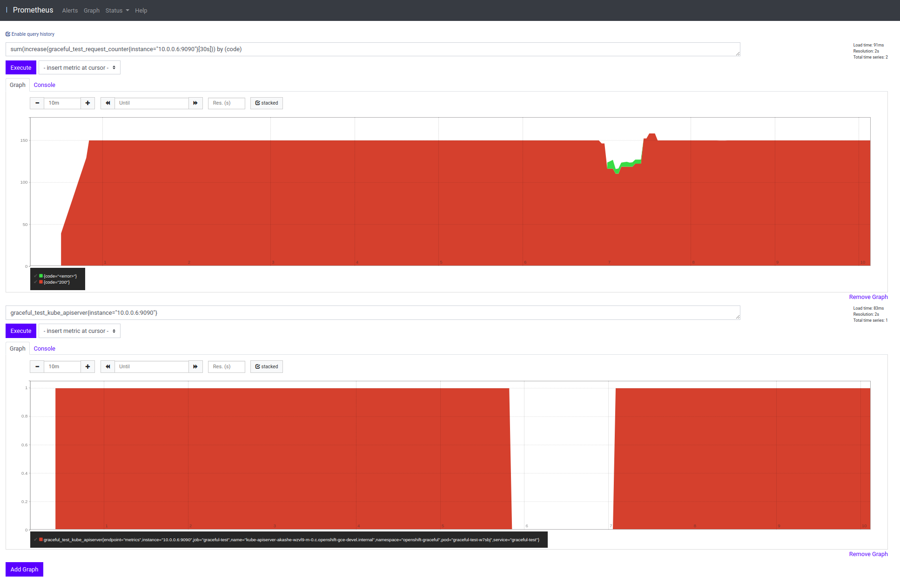
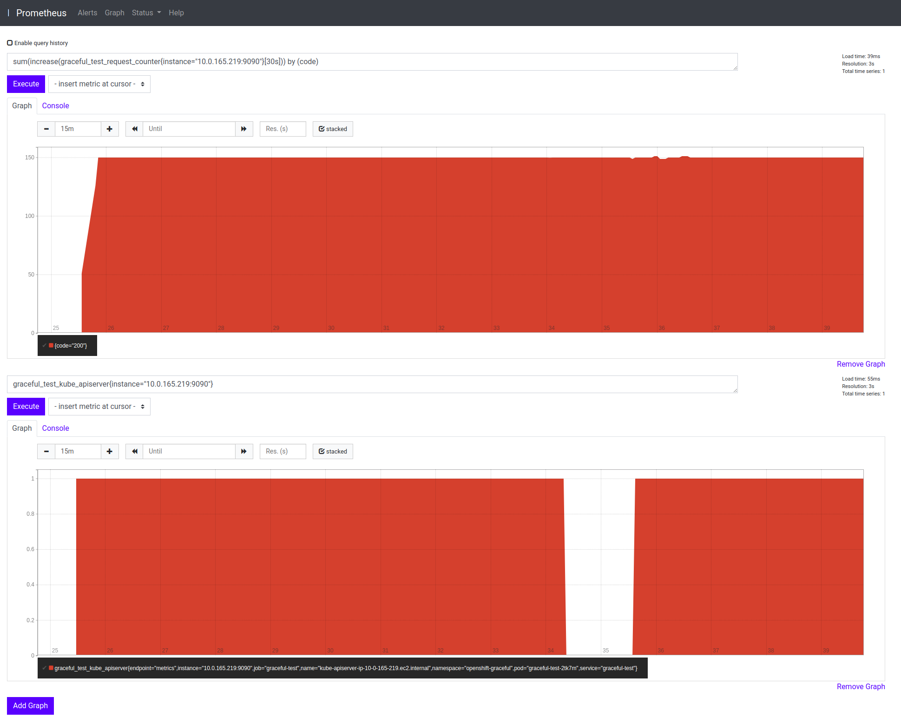

## Background
The control plane component(s) such as `kubelet` uses an internal load balancer to talk to `kube-apiserver`. While `kube-apiserver` is rolling out we want to ensure that:
* New connection(s) are accepted within a certain grace period.
* The in-flight connections are given enough time to complete. 
 
Related BZ: https://bugzilla.redhat.com/show_bug.cgi?id=1802534

In GCE we use an `Internal TCP Load Balancer` to route internal traffic to the API server. GCP internal load balancer has the following characteristics:
* It is not `proxy` based.
* A request is always sent to the VM that makes the request, and health check information is ignored. This implies that any request originating from a control plane component on a master node is always routed to the `kube-apiserver` on the same node irrespective of whether `/readyz` reports a failure.

## Objective
We have the following objectives:
* Write a test suite that we can use to reproduce this issue consistently.
* Find a solution to the issue.

## Configuration:
`kube-apiserver` has the following configuration(s) to deal with graceful termination.
* `shutdown-delay-duration` is set to 70s
```bash
kubectl -n openshift-kube-apiserver get cm config -o json | jq -r '.data."config.yaml"' | jq '.apiServerArguments."shutdown-delay-duration"'
[
  "70s"
]
```

* `RequestTimeout` is by default set to `60s`.
https://github.com/kubernetes/kubernetes/blob/master/staging/src/k8s.io/apiserver/pkg/server/config.go#L300

* `terminationGracePeriodSeconds` is set to `135s`.
https://github.com/openshift/cluster-kube-apiserver-operator/blob/master/bindata/v4.1.0/kube-apiserver/pod.yaml#L154
```
terminationGracePeriodSeconds: 135 # bit more than 70s (minimal termination period) + 60s (apiserver graceful termination)
```

* no `preStopHook` defined.

### Load Balancer Settings


## Implementation

### Strategy:
The test will have the following characteristics:
* The test will run inside a `Pod` for convenience.
* The test `Pod` will have `hostNetwork` enabled (`hostnetwork: true`) to utilize the host network used by the control plane components like kubelet. This ensures that the test avoids kubernetes `Service` network and uses the host's network to reach the `kube-apiserver`. 
* We want to use the address of the internal load balancer to reach the `kube-apiserver`. We access the `kubeconfig` used by kubelet on the node and use the `Host` URL. This is always set to the internal load balancer URL.
```yaml
apiVersion: apps/v1
kind: DaemonSet
spec:
  template:
    spec:
      hostNetwork: true
      securityContext:
        runAsUser: 0
      containers:
        - name: graceful-test
          securityContext:
            privileged: true
          command:
            - /usr/bin/graceful-test
            - -kubelet-kubeconfig=/var/lib/kubelet/kubeconfig
          volumeMounts:
          - mountPath: /var/lib/kubelet
            name: kubeconfig
      volumes:
      - name: kubeconfig
        hostPath:
          path: /var/lib/kubelet
```
* The test will run on each master node and will continuously issue request(s) to the API server.
    * When `kube-apiserver` restarts on a particular node, `/readyz` will not report `200` and the internal load balancer should not forward any traffic to it until the new process starts reporting `200` on `readyz` again. In essence, we should not see any new or exisitng connections being dropped by this API server.
* We also need to run the test where it connects to the API server using the external load balancer URL.     
* The test will emit the following metrics:
    * A counter that counts the number of requests the test is issuing with the following labels `code`, `method`.
    * A gauge that emits `1` if the designated `kube-apiserver` `Pod` is reporting `Running`, otherwise `0`. This is so that we can coincide the API request error(s) with the time `kube-apiserver` is rolling out. An improvement would be to run health check on `/readyz` and `/healthz` and report on their status. 
* While the test is running, we will simulate a `kube-apiserver` roll out by changing the `logLevel` of `KubeAPIServer` config object.

## Test Runs
We ran the test on both aws and gcp cluster independently, the result is as follows:
* We saw no connection(s) being dropped on a cluster on AWS.
* In GCP, on the other hand, we saw that request(s) originating from the test pod are being dropped, we saw the following error(s):
```
I0224 01:57:46.917308       1 main.go:28] kubeConfigPath=
I0224 01:57:46.917504       1 main.go:29] kubeletkubeConfigPath=/var/lib/kubelet/kubeconfig
I0224 01:57:46.917513       1 main.go:30] kubeAPIServerPodName=kube-apiserver-akashe-wzvl9-m-0.c.openshift-gce-devel.internal
W0224 01:57:46.921860       1 client_config.go:543] Neither --kubeconfig nor --master was specified.  Using the inClusterConfig.  This might not work.
I0224 01:57:46.922725       1 main.go:37] rest.Config.Host=https://api-int.akashem.gcp.devcluster.openshift.com:6443

E0224 02:06:54.536597       1 calls.go:17] call error=Get https://api-int.akashem.gcp.devcluster.openshift.com:6443/api/v1/namespaces/openshift-kube-apiserver/configmaps/config: dial tcp 10.0.0.2:6443: connect: connection refused
E0224 02:06:54.736010       1 calls.go:17] call error=Get https://api-int.akashem.gcp.devcluster.openshift.com:6443/api/v1/namespaces/openshift-kube-apiserver/configmaps/config: dial tcp 10.0.0.2:6443: connect: connection refused
E0224 02:06:54.936045       1 calls.go:40] getAllConfigMaps error=Get https://api-int.akashem.gcp.devcluster.openshift.com:6443/api/v1/configmaps: dial tcp 10.0.0.2:6443: connect: connection refused
E0224 02:06:55.146369       1 calls.go:17] call error=Get https://api-int.akashem.gcp.devcluster.openshift.com:6443/api/v1/namespaces/openshift-kube-apiserver/configmaps/config: dial tcp 10.0.0.2:6443: connect: connection refused
E0224 02:06:55.335986       1 calls.go:17] call error=Get https://api-int.akashem.gcp.devcluster.openshift.com:6443/api/v1/namespaces/openshift-kube-apiserver/configmaps/config: dial tcp 10.0.0.2:6443: connect: connection refused
E0224 02:06:55.535875       1 kube-apiserver-status.go:49] name=openshift-kube-apiserver/kube-apiserver-akashe-wzvl9-m-0.c.openshift-gce-devel.internal failed to get kube-apiserver pod - Get https://api-int.akashem.gcp.devcluster.openshift.com:6443/api/v1/namespaces/openshift-kube-apiserver/pods/kube-apiserver-akashe-wzvl9-m-0.c.openshift-gce-devel.internal: dial tcp 10.0.0.2:6443: connect: connection refused
E0224 02:06:55.736067       1 calls.go:17] call error=Get https://api-int.akashem.gcp.devcluster.openshift.com:6443/api/v1/namespaces/openshift-kube-apiserver/configmaps/config: dial tcp 10.0.0.2:6443: connect: connection refused
```

The above highlights a test run on gcp cluster, it hones in on a particular `kube-apiserver` Pod. The graph at the bottom (of the above image) is a gauge which stays at `1` if the target `kube-apiserver` Pod is `Running`, otherwise it stays at zero. You can see that the error(s) reported by the test coincides with the `kube-apiserver` Pod rolling out.

On the other hand, we see no errors when we run the same test against a cluster on aws (the image below).


This test does not deal with long running connection(s). With long running connection(s) the server should send a `GOAWAY` when it stops listening. When the client receives a `GOAWAY` frame it resets the connection and retries.  

Next Steps:
* Fix graceful termination issue with the gcp-route based internal load balancer.
* In addition to running the test on master node, run it externally to use the public load balance to ensure that graceful termination works across the board.
